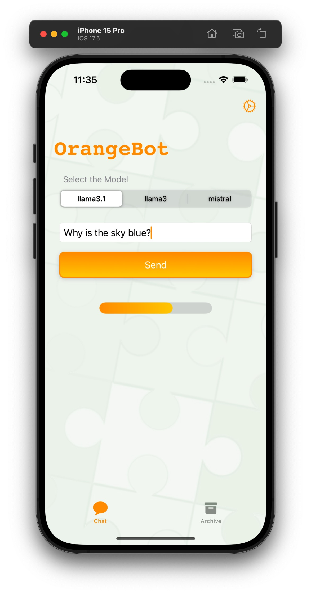
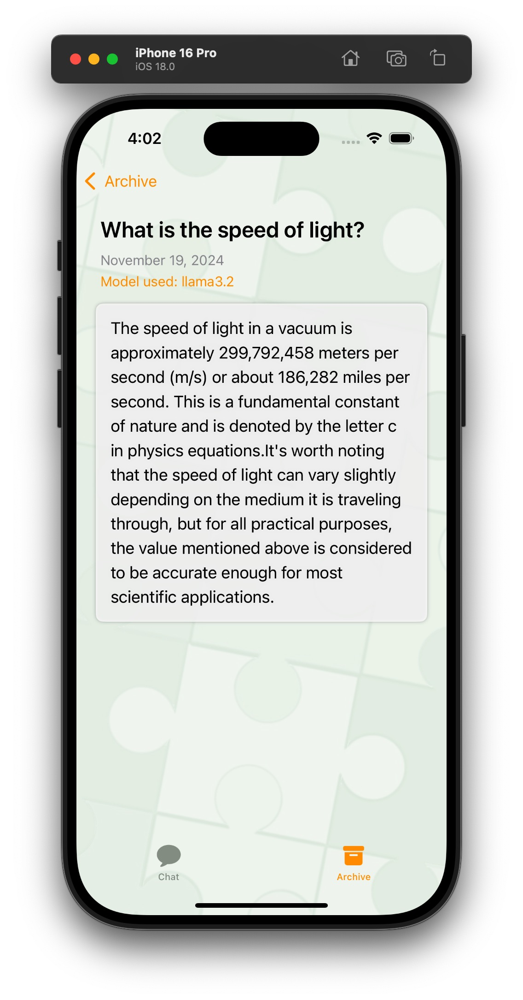
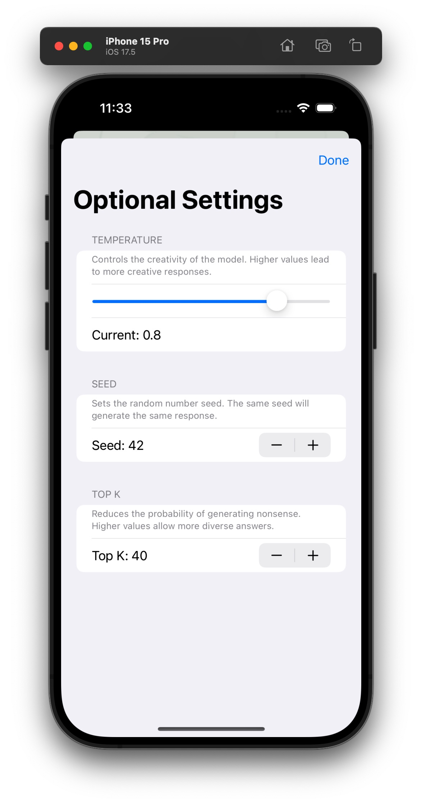

# OrangeBot: A Simple AI Chatbot

OrangeBot is an iOS application that interacts with multiple AI models, including `llama3`, `llama3.1`, and `mistral`, to provide chatbot responses to user queries. The app is built using SwiftUI and communicates with a local backend service via HTTP POST requests.

## Features

- **Multi-Model Support**: Select between different AI models (e.g., `llama3`, `llama3.1`, `mistral`) to generate responses.
- **Customizable Settings**: Adjust the chatbot's behavior with parameters such as temperature, seed, and top_k through an intuitive settings interface.
- **Chat History**: Archive your chat history locally for future reference.
- **Markdown Support**: The responses from the AI are rendered using markdown, allowing for rich-text formatting.
- **Offline Access**: Chat history is stored locally using `UserDefaults`, enabling offline access.

## Screenshots






## Requirements

- Xcode 12 or later
- iOS 17.0 or later
- Swift 5.3 or later

## Getting Started

### Prerequisites

Before you can run the project, make sure you have the following installed:

- Xcode (latest version recommended)
- iOS simulator or a physical iOS device
- A local backend service running at `http://localhost:11434/api/chat`

### Installation

1. **Clone the repository**:

    ```bash
    git clone <https://github.com/AtsukoKuwahara/SimpleAIChatbot.git>
    cd SimpleAIChatbot
    ```

2. **Open the project in Xcode**:

    ```bash
    open SimpleAIChatbot.xcodeproj
    ```

3. **Install dependencies** (if any):

    If your project uses Swift Package Manager, ensure all dependencies are installed by going to `File > Swift Packages > Update to Latest Package Versions`.

4. **Run the backend server**:

    Ensure that the backend service (e.g., a Flask app or any other service that the app communicates with) is running on `http://localhost:11434`.

5. **Build and Run the app**:

    Select your target device or simulator in Xcode and click the `Run` button.

### Backend Service

This project assumes a backend service is running locally to handle chat requests. The service should accept POST requests at `/api/chat` and return a JSON response.

Example JSON Request:
```json
{
  "model": "llama3.1",
  "messages": [
    { "role": "user", "content": "Why is the sky blue?" }
  ],
  "options": {
    "seed": seed,
    "temperature": temperature,
    "top_k": top_k
    },
  "stream": false
}
```

### Usage

1. **Select the Model**: Choose an AI model (`llama3`, `llama3.1`, or `mistral`) from the picker at the top of the chat screen.
2. **Ask a Question**: Enter your question in the text field and press "Send".
3. **View Responses**: The response will appear below the text field. You can view the chat history in the "Archive" tab.
5. **Adjust Settings: Tap the gear icon to open the settings view and customize the chatbot's parameters such as temperature, seed, and top_k.
4. **View Details**: Tap on an entry in the Archive to view the full conversation and the model used.

### Code Structure

- **ContentView.swift**: The main view of the app containing the TabView with `ChatView` and `ArchiveView`.
- **ChatView.swift**: Handles the user input and displays the AI's response.
- **ArchiveView.swift**: Displays a list of past interactions.
- **ChatDetailView.swift**: Shows the details of a selected chat entry.
- **SettingsView.swift**: Provides controls to customize chatbot parameters like temperature, seed, and top_k.
- **NetworkService.swift**: Contains the logic for making HTTP POST requests to the backend.

### Customization

- **Modify the Backend URL**: Change the `url` in `NetworkService.swift` to point to your custom backend service.
- **Add New Models**: Extend the picker options in `ChatView.swift` to include new AI models.
- **Adjust Default Settings**: Modify the default values in `SettingsView.swift` to change how the chatbot behaves initially.

